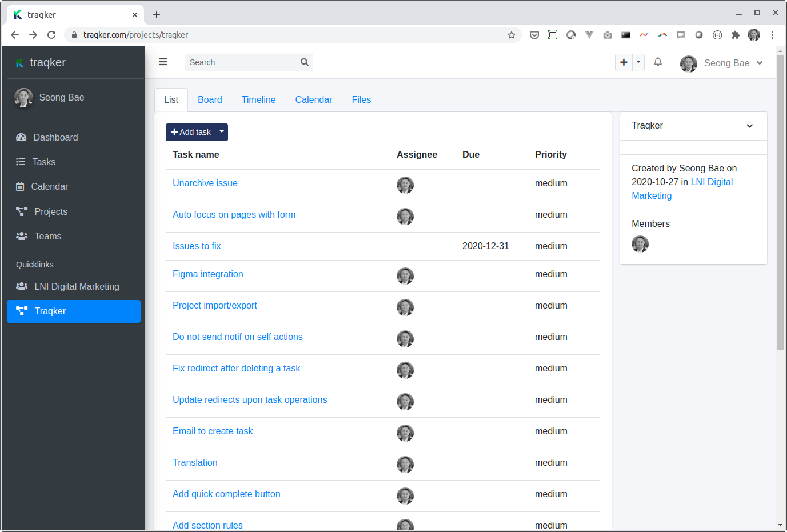

<!-- PROJECT SHIELDS -->
<!--
*** I'm using markdown "reference style" links for readability.
*** Reference links are enclosed in brackets [ ] instead of parentheses ( ).
*** See the bottom of this document for the declaration of the reference variables
*** for contributors-url, forks-url, etc. This is an optional, concise syntax you may use.
*** https://www.markdownguide.org/basic-syntax/#reference-style-links
-->
[![Contributors][contributors-shield]][contributors-url]
[![Forks][forks-shield]][forks-url]
[![Stargazers][stars-shield]][stars-url]
[![Issues][issues-shield]][issues-url]
[![MIT License][license-shield]][license-url]
[![LinkedIn][linkedin-shield]][linkedin-url]


<!-- PROJECT LOGO -->
<p align="center">
  
  <h3 align="center">Traqker</h3>

  <p align="center">
    Traqker is an open source project management tool.
  </p>
</p>


<!-- TABLE OF CONTENTS -->
## Table of Contents

* [About the Project](#about-the-project)
  * [Built With](#built-with)
* [Getting Started](#getting-started)
  * [Prerequisites](#prerequisites)
  * [Installation](#installation)
* [Usage](#usage)
* [Roadmap](#roadmap)
* [Contributing](#contributing)
* [License](#license)
* [Contact](#contact)
* [Acknowledgements](#acknowledgements)


<!-- ABOUT THE PROJECT -->
## About The Project



Traqker is a simple project management tool for small to medium-sized teams. 

Features:
* Manage projects
* Archive projects
* Manage teams - create teams and add/remove members
* Manage tasks
* Track task status
* View tasks on a calendar and kanban board
* Share files with teams


### Built With
* [Laravel](https://laravel.com)
* [Canvas](https://github.com/seongbae/canvas)
* [Bootstrap](https://getbootstrap.com)
* [JQuery](https://jquery.com)

<!-- GETTING STARTED -->
## Getting Started

### Prerequisites

This is an example of how to list things you need to use the software and how to install them.
* PHP 7+
* MySQL
* Apache or nginx

### Installation

1. Clone the repo
```sh
git clone https://github.com/seongbae/traqker.git
```
2. Install Composer libraries
```sh
composer install
```
3. Install NPM packages
```sh
npm install
```


<!-- USAGE EXAMPLES -->
## Usage

Documentation will be added later.


<!-- ROADMAP -->
## Roadmap

See the [open issues](https://github.com/seongbae/traqker/issues) for a list of proposed features (and known issues).

<!-- CONTRIBUTING -->
## Contributing

Contributions are what make the open source community such an amazing place to be learn, inspire, and create. Any contributions you make are **greatly appreciated**.

1. Fork the Project
2. Create your Feature Branch (`git checkout -b feature/AmazingFeature`)
3. Commit your Changes (`git commit -m 'Add some AmazingFeature'`)
4. Push to the Branch (`git push origin feature/AmazingFeature`)
5. Open a Pull Request

<!-- LICENSE -->
## License

Distributed under the MIT License. See `LICENSE` for more information.


<!-- CONTACT -->
## Contact

Seong Bae - [@baeseong](https://twitter.com/baeseong) - seong@lnidigital.com

Project Link: [https://github.com/seongbae/traqker](https://github.com/seongbae/traqker)


<!-- ACKNOWLEDGEMENTS -->
## Acknowledgements
* [GitHub Emoji Cheat Sheet](https://www.webpagefx.com/tools/emoji-cheat-sheet)
* [Img Shields](https://shields.io)
* [Choose an Open Source License](https://choosealicense.com)
* [GitHub Pages](https://pages.github.com)
* [Animate.css](https://daneden.github.io/animate.css)
* [Loaders.css](https://connoratherton.com/loaders)
* [Slick Carousel](https://kenwheeler.github.io/slick)
* [Smooth Scroll](https://github.com/cferdinandi/smooth-scroll)
* [Sticky Kit](http://leafo.net/sticky-kit)
* [JVectorMap](http://jvectormap.com)
* [Font Awesome](https://fontawesome.com)


<!-- MARKDOWN LINKS & IMAGES -->
<!-- https://www.markdownguide.org/basic-syntax/#reference-style-links -->
[contributors-shield]: https://img.shields.io/github/contributors/seongbae/traqker.svg?style=flat-square
[contributors-url]: https://github.com/seongbae/traqker/graphs/contributors
[forks-shield]: https://img.shields.io/github/forks/seongbae/traqker.svg?style=flat-square
[forks-url]: https://github.com/seongbae/traqker/network/members
[stars-shield]: https://img.shields.io/github/stars/seongbae/traqker.svg?style=flat-square
[stars-url]: https://github.com/seongbae/traqker/stargazers
[issues-shield]: https://img.shields.io/github/issues/seongbae/traqker.svg?style=flat-square
[issues-url]: https://github.com/seongbae/traqker/issues
[license-shield]: https://img.shields.io/badge/License-MIT-yellow.svg?style=flat-square
[license-url]: https://opensource.org/licenses/MIT
[linkedin-shield]: https://img.shields.io/badge/-LinkedIn-black.svg?style=flat-square&logo=linkedin&colorB=555
[linkedin-url]: https://linkedin.com/in/baeseong
[product-screenshot]: images/screenshot.png
